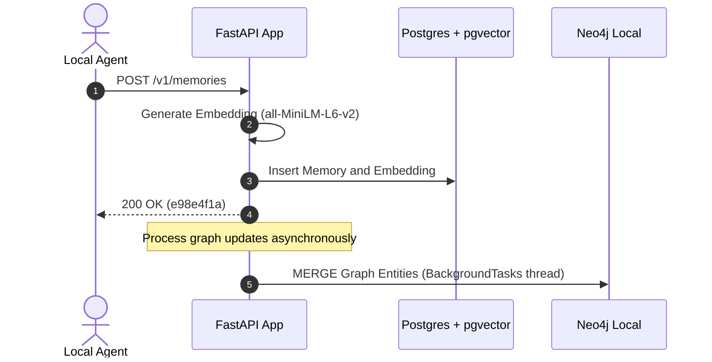
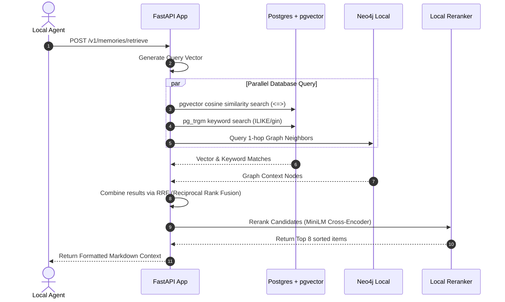

# AI Memory Operating System (MemoryOS)
## Architecture Design Document (ADD) - Local-First & Free Tier

**Document Version:** 1.1.0  
**Authors:** AI Architect & Systems Engineer  
**Status:** Approved (Local-First Design)  
**Target Audience:** Personal Project Development, Independent Developers, and Local Prototyping Teams  

---

## 1. Executive Summary

### 1.1 Problem Statement
Modern Large Language Models (LLMs) operate under a stateless paradigm. Context windows are transient. When a session terminates, the model's immediate state is lost. Passing the entire history of interactions inside the prompt window introduces substantial challenges:
1. **Linear Cost Scaling:** Token ingestion costs scale with conversation length.
2. **Latency Degradation:** Time-to-First-Token (TTFT) and processing latencies increase as prompt length grows.
3. **Context Dilution:** LLMs fail to retrieve or weigh information in the middle of long contexts.
4. **Lack of Evolution:** Traditional systems do not synthesize or adapt user preferences over time.

### 1.2 Personal Project & Local-First Value
For independent developers and personal projects, deploying complex, enterprise cloud-hosted clusters (like Kafka, enterprise Neo4j Aura, Qdrant Cloud, and paid Reranker APIs) is cost-prohibitive. This architecture pivots MemoryOS to a **100% free, local-first stack** designed to run on a single developer machine (e.g., laptop or $5/month VPS) while maintaining high performance.
* **Zero API Costs:** Uses local database containers and offline open-source embedding/reranking models.
* **Low Memory Footprint:** Consolidated storage utilizing PostgreSQL with the `pgvector` extension reduces RAM overhead by eliminating standalone vector databases.
* **Zero Cloud Dependencies:** Fully functional offline, making it highly portable and secure.

### 1.3 Why Traditional RAG is Insufficient
Even in local apps, traditional Retrieval-Augmented Generation (RAG) is insufficient:
* **Stateless Retrieval:** RAG treats queries independently and lacks temporal awareness.
* **Vector-Only Search Limitations:** Top-K vector search lacks relational reasoning (e.g., identifying "the model I used for project X last week").
* **No Contradiction Resolution:** If a user says, "I am studying Python" and later "I switched to Rust," standard RAG returns both, causing LLM confusion.
* **No Synthesis:** Traditional RAG retrieves raw chunks; it does not consolidate episodic events into generalized semantic facts.

---

## 2. High-Level Architecture

MemoryOS is designed as a lightweight, local-first service using FastAPI and Docker Compose.

### 2.1 Component Overview

```
                      +-------------------+
                      |   AI Agent / MCP  |
                      +---------+---------+
                                | REST / MCP Protocol
                                v
                      +-------------------+
                      |    FastAPI App    |
                      +---------+---------+
                                |
        +-----------------------+-----------------------+
        | Ingestion Flow (Async)                        | Retrieval Flow (Sync)
        v (FastAPI BackgroundTasks)                     v
+-------+-------+                               +-------+-------+
|  Local Task   |                               | SQLite/Memory |
|  Thread Pool  |                               | Cache Layer   |
+-------+-------+                               +-------+-------+
        |                                               | Cache Miss
        v                                               v
+-------+-------+                               +-------+-------+
| Ingestion     |                               | Hybrid        |
| Task Handler  |                               | Retriever     |
+-------+-------+                               +-------+-------+
        |                                         |     |     |
        |-- Entity Extraction                     |     |     |-- Keyword (pg_trgm)
        |-- Embedding Generation                  |     |     v
        |-- Contradiction Resolution              |     |  +-------------------+
        v                                         |     |  | PostgreSQL        |
+-------+-----------------------------+           |     |  | (Metadata Table)  |
| Local Persistence Layer (Docker)    |           |     |  +-------------------+
|                                     |           |     v
|  +-------------------------------+  |           |  +-------------------+
|  | PostgreSQL + pgvector         |  |  <--------+  | PostgreSQL        |
|  | (Metadata + Dense Vectors)    |  |              | (vector index)    |
|  +-------------------------------+  |              +-------------------+
|  | Neo4j Community               |  |              v
|  | (Entity Relationship Graph)   |  |        +-------------------+
|  +-------------------------------+  |        | Neo4j Community   |
+-------------------------------------+        +-------------------+
                                                        |
                                                        v
                                               +-------------------+
                                               | Local Reranker    |
                                               | (SentenceTrans.)  |
                                               +---------+---------+
                                                         | Sorted Context
                                                         v
                                                  [Agent Response]
```

### 2.2 Layered Architecture and Boundaries
1. **FastAPI Application Server:** Acts as both the API server and the MCP Host. It processes requests, runs local ML models, and orchestrates database transactions.
2. **FastAPI BackgroundTasks Engine:** Replaces heavy message queues (Kafka/RabbitMQ) with Python's native asynchronous thread executor to handle ingestion pipelines without blocking client calls.
3. **Hybrid Retriever:** Queries PostgreSQL (for pg_trgm fuzzy matching and pgvector similarity) and Neo4j in parallel, assembling a combined candidate list.
4. **Local ML Models:** Uses `sentence-transformers` to execute dense embeddings and reranking tasks locally on CPU/GPU.
5. **Docker Compose Tier:** Encapsulates the entire persistence stack (PostgreSQL with pgvector and Neo4j Community) in a single-file deployment.

---

## 3. Memory Hierarchy Design

MemoryOS divides memory into three tiers, mapping closely to local system memory hierarchies.

```
+-------------------------------------------------------------------------+
| SHORT-TERM MEMORY (STM)                                                 |
| Cache Layer | TTL: Minutes/Hours | Storage: Python dict / local Redis    |
| Context: Active conversation window, current tokens, reasoning trace.   |
+------------------------------------+------------------------------------+
                                     | Promotion: Session summary,
                                     | key event extraction
                                     v
+-------------------------------------------------------------------------+
| MID-TERM MEMORY (MTM)                                                  |
| Ram Layer | TTL: Weeks/Months | Storage: pgvector + PostgreSQL          |
| Context: Episodic clusters, recent tasks, temporal logs.                 |
+------------------------------------+------------------------------------+
                                     | Promotion: Graph synthesis,
                                     | repeated reference detection
                                     v
+-------------------------------------------------------------------------+
| LONG-TERM MEMORY (LTM)                                                  |
| Disk Layer | TTL: Indefinite | Storage: Neo4j (local) & PostgreSQL      |
| Context: User profile, preferences, facts, structural relationships.     |
+-------------------------------------------------------------------------+
```

### 3.1 Tier Details and Lifecycle

| Feature | Short-Term Memory (STM) | Mid-Term Memory (MTM) | Long-Term Memory (LTM) |
| :--- | :--- | :--- | :--- |
| **Concept** | Cache / Scratchpad | Working Memory | Consolidated knowledge |
| **Data Scope** | Last 10-20 turns | Session logs, semantic chunks | Facts, user preferences, entity graph |
| **Storage Backend** | Local Redis / Python Cache | PostgreSQL + `pgvector` | Neo4j Community + PostgreSQL |
| **Typical TTL** | 1-2 hours / Session-bound | 30 - 90 days | Indefinite (regulated by decay) |
| **Access Latency** | <5ms | <25ms | <80ms |

### 3.2 Promotion and Demotion Policies
* **Promotion (STM -> MTM):** Triggered when a session closes. A background task runs a local LLM call to extract key facts and summaries, generating embeddings stored in `pgvector`.
* **Promotion (MTM -> LTM):** Triggered during consolidation. If an item is referenced across multiple sessions (Frequency count $N \ge 3$) or carries high semantic Importance ($I \ge 0.8$), it is inserted into the local Neo4j database.
* **Demotion & Forgetting (LTM -> Archival/Deletion):** Triggered when a node's decay score drops below $S_{threshold} = 0.15$. Demoted records are written to a local `.jsonl` file (cold archival storage) and deleted from active SQL and Graph databases.

---

## 4. Memory Lifecycle

The lifecycle of a memory in a local-first system is optimized for CPU efficiency:

```
[Ingestion] -> [Extraction] -> [Classification] -> [Scoring] -> [Storage]
                                                                     |
[Deletion]  <- [Archival]   <- [Decay]          <- [Retrieval] <- [Consolidation]
```

### 4.1 Step-by-Step Lifecycle Description
1. **Ingestion:** Raw interactions (user prompt, agent output) are sent to `/v1/memories`.
2. **Extraction:** Handled asynchronously via FastAPI's `BackgroundTasks`. The local FastAPI worker extracts entities and facts.
3. **Classification:** Facts are tagged as *Factual*, *Episodic*, *Preference*, or *Behavioral*.
4. **Scoring:** Importance ($I$) and Emotional Valence ($E$) are computed.
5. **Storage:** The system writes to PostgreSQL (writing metadata and the embedding vector to a `vector` column) and Neo4j (writing nodes/edges).
6. **Consolidation:** Periodically merges duplicate graph nodes and resolves contradictory facts.
7. **Retrieval:** Multi-threaded SQL and Cypher queries fetch candidates on demand.
8. **Decay:** Time-based scoring decays historical weights.
9. **Archival:** Records with low scores are exported to a local JSON archive.
10. **Deletion:** Instantly deletes user data across Postgres and Neo4j upon request.

---

## 5. Retrieval Architecture

MemoryOS uses a simplified, high-performance local retrieval engine.

### 5.1 Hybrid Retrieval Flow
When a query is received, the system runs two queries in parallel:
1. **Dense Vector Search (PostgreSQL + pgvector):** Performs semantic search using Cosine Distance (`<=>`) index scans.
2. **Keyword Search (PostgreSQL):** Uses trigram indexes (`pg_trgm`) to match exact terms, code snippets, or names.
3. **Graph Traversal (Neo4j):** Extracts local entity-relationship paths related to identified keywords.

```
                 +-------------------+
                 |    User Query     |
                 +---------+---------+
                           |
        +------------------+------------------+
        |                  |                  |
        v                  v                  v
+---------------+  +---------------+  +---------------+
| Vector Search |  |  Graph Query  |  | Keyword Search|
|  (pgvector)   |  | (Local Neo4j) |  |   (pg_trgm)   |
+-------+-------+  +-------+-------+  +-------+-------+
        |                  |                  |
        +------------------+------------------+
                           |
                           v
                 +-------------------+
                 | Reciprocal Rank   |
                 |   Fusion (RRF)    |
                 +---------+---------+
                           | Top 30 Candidates
                           v
                 +-------------------+
                 | Local Reranker    |
                 | (MiniLM / ONNX)   |
                 +---------+---------+
                           | Top 8 Re-ordered
                           v
                 +-------------------+
                 | Context Assembly  |
                 +---------+---------+
                           | Formatted Markdown Prompt
                           v
                 +-------------------+
                 |    To LLM/Agent   |
                 +-------------------+
```

### 5.2 Reranking & Context Assembly
* **Reranking:** The candidate pool is merged using Reciprocal Rank Fusion (RRF). The top 30 merged items pass to a local, CPU-optimized Cross-Encoder model (e.g., `cross-encoder/ms-marco-MiniLM-L-6-v2`, requiring only ~80MB RAM).
* **Context Assembly:** Candidates are sorted by final score. The Context Assembler formats the top results into structured markdown sections within the local agent's prompt window.

---

## 6. Knowledge Graph Layer

The Knowledge Graph represents the structural memory of relationships and facts locally, using Neo4j Community Edition.

```
       [Works At]       [Interested In]
User ------------> Company ----------> Industry
  |                                      ^
  | [Building]                           | [Associated With]
  +--------------> AI Agent -------------+
```

### 6.1 Entity & Relationship Extraction
Extraction is performed via structured JSON extraction using a local, cost-effective LLM or local parsing scripts:
```json
{
  "entities": [
    {"id": "user_1", "label": "Person", "properties": {"name": "Bob"}},
    {"id": "lang_rust", "label": "Language", "properties": {"name": "Rust"}}
  ],
  "relationships": [
    {"source": "user_1", "target": "lang_rust", "type": "FAVORITE_LANGUAGE", "properties": {"level": "Expert"}}
  ]
}
```

### 6.2 Contradiction Resolution Flow
1. **Detection:** When inserting a relation (e.g., `User` -> `USES_EDITOR` -> `VSCode`), the database checks if another editor relationship exists.
2. **Validation:** If conflict occurs (e.g., `VSCode` vs `Neovim`), a validation logic compares timestamps.
3. **Resolution:** Since it's a local app, the latest timestamp takes precedence. The older relationship is marked inactive (`active = false`) in PostgreSQL, and the Neo4j edge property is updated, minimizing LLM usage.

---

## 7. Memory Scoring Engine

To maintain high precision without heavy servers, memories are scored dynamically.

### 7.1 Mathematical Formulations

#### 1. Importance Score ($I$)
Extracted during ingestion by scoring semantic impact:
$$I \in [0.0, 1.0]$$

#### 2. Recency Score ($R$)
Modeled using an exponential decay function:
$$R(t) = e^{-\lambda \cdot \Delta t}$$
Where:
* $\Delta t = t_{current} - t_{last\_accessed}$ (expressed in days).
* $\lambda$ is the decay constant. For local projects, we set a single standard decay parameter $\lambda = 0.05$ (half-life of $\approx 13.8$ days).

#### 3. Frequency Score ($F$)
Uses a logarithmic scaling function to reward repetition:
$$F(N) = \frac{\ln(N + 1)}{\ln(N_{max} + 1)}$$
Where:
* $N$ is the access count.
* $N_{max}$ is a saturation constant (set to 20 for local apps).

#### 4. Combined Retrieval Score ($S$)
The total selection weight is computed as:
$$S = w_I \cdot I + w_R \cdot R(t) + w_F \cdot F(N) + w_E \cdot E$$
Where:
* $w_I = 0.40, w_R = 0.35, w_F = 0.25$ (with $w_E = 0.00$ to bypass emotional scoring unless specifically needed, saving processing cycles).
* Weights satisfy: $w_I + w_R + w_F = 1.0$.

---

## 8. Memory Consolidation Engine

Consolidation runs locally as a background task during low-activity intervals.

```
[Raw Episodic Streams] 
       |
       v (Clustering Embeddings & Temporal Matching)
[Local Consolidation Task]
       |
       +---> Merges duplicate nodes / entities in Neo4j
       +---> Synthesizes repeated events into generalized preferences
       +---> Compresses oldest episodic chunks into rolling summaries
```

### 8.1 Consolidation Mechanics
* **Entity Merging:** Resolves near-duplicates (e.g., "Python" vs "python3"). Entities with a vector distance $< 0.12$ are merged using Neo4j Cypher refactoring.
* **Generalization:** Consolidates repetitive logs into single fact blocks:
  * *Example:* "User set editor to Neovim on Monday," "User configured Neovim plugins on Tuesday" -> Generalized preference: `User uses Neovim editor` ($I=0.90$).
* **Memory Summarization:** Rather than deleting decaying memories, local LLMs compress older chat streams into high-level monthly summaries.

---

## 9. Forgetting and Decay Engine

### 9.1 Decay Schedules and Archival

```
                     +---------------------------+
                     | Calculate Retrieval Score |
                     +-------------+-------------+
                                   |
                     +-------------v-------------+
                     |      Is Score < 0.15?     |
                     +-------+-----------+-------+
                             |           |
                        Yes  |           | No
                             v           v
                     +-------+---+   +---+-------+
                     |  Archive  |   | Keep Live |
                     +-------+---+   +-----------+
                             |
                     +-------v-------+
                     | Hard Deletion | (If requested / expired)
                     +---------------+
```

* **Decay Sweeper:** A daily background job calculates recency updates. If $S < 0.15$, the memory is flagged.
* **Local Archival:** Flagged memories are appended to a local `archive.jsonl` file to keep the active Postgres and Neo4j database indices clean and fast.
* **Local Hard Purge:** A single database transaction cascading delete purges the matching UUID from PostgreSQL and drops corresponding Neo4j node links.

---

## 10. Multi-Agent Memory Architecture

Even for a personal project, isolating different projects, agent roles, or workspaces is critical.

```
       +---------------------------------------------+
       | Org Workspace (All Agents - Read Only)      |
       +---------------------------------------------+
                              ^
                              | Inherits context
       +----------------------+----------------------+
       | Team Workspace (Group of Agents)            |
       +---------------------------------------------+
                              ^
                              | Inherits context
       +----------------------+----------------------+
       | Personal Workspace (Single Agent / User)    |
       +---------------------------------------------+
```

### 10.1 Workspace Separation
* **PostgreSQL:** Filters query results using a `workspace_id` column.
* **Neo4j Graph:** Nodes are tagged with a `:Workspace` label and filtered in Cypher queries:
  ```cypher
  MATCH (u:User)-[r]->(e:Entity)
  WHERE u.workspace_id = $workspace_id
  RETURN u, r, e
  ```

---

## 11. Data Model

### 11.1 SQL Schema Definitions (PostgreSQL + pgvector)

```sql
-- Enable the vector and trigram extensions
CREATE EXTENSION IF NOT EXISTS vector;
CREATE EXTENSION IF NOT EXISTS pg_trgm;

-- Core User Table
CREATE TABLE users (
    id VARCHAR(64) PRIMARY KEY,
    created_at TIMESTAMP WITH TIME ZONE DEFAULT CURRENT_TIMESTAMP
);

-- Active Sessions for STM management
CREATE TABLE sessions (
    id VARCHAR(64) PRIMARY KEY,
    user_id VARCHAR(64) REFERENCES users(id) ON DELETE CASCADE,
    started_at TIMESTAMP WITH TIME ZONE DEFAULT CURRENT_TIMESTAMP,
    ended_at TIMESTAMP WITH TIME ZONE
);

-- Central Memory Store with pgvector Embeddings
CREATE TABLE memories (
    id UUID PRIMARY KEY,
    user_id VARCHAR(64) REFERENCES users(id) ON DELETE CASCADE,
    session_id VARCHAR(64) REFERENCES sessions(id) ON DELETE SET NULL,
    workspace_id VARCHAR(64) NOT NULL DEFAULT 'default',
    content TEXT NOT NULL,
    embedding vector(384) NOT NULL, -- 384 dimensions for lightweight local models (e.g. all-MiniLM-L6-v2)
    memory_type VARCHAR(32) NOT NULL DEFAULT 'EPISODIC', -- EPISODIC, FACTUAL, PREFERENCE
    importance_score NUMERIC(3, 2) NOT NULL DEFAULT 0.50,
    frequency_count INT NOT NULL DEFAULT 1,
    is_active BOOLEAN NOT NULL DEFAULT TRUE,
    created_at TIMESTAMP WITH TIME ZONE DEFAULT CURRENT_TIMESTAMP,
    last_accessed_at TIMESTAMP WITH TIME ZONE DEFAULT CURRENT_TIMESTAMP
);

-- Indexes for vector searches and text fuzzy matching
CREATE INDEX idx_memories_embedding ON memories USING hnsw (embedding vector_cosine_ops);
CREATE INDEX idx_memories_trgm ON memories USING gin (content gin_trgm_ops);
CREATE INDEX idx_memories_lookup ON memories(user_id, workspace_id, is_active);
```

### 11.2 Neo4j Graph Model
* **Nodes:**
  * `User {id: String, name: String, workspace_id: String}`
  * `Entity {name: String, type: String, workspace_id: String}`
* **Relationships:**
  * `WORKS_AT {since: String}`
  * `INTERESTED_IN {weight: Float}`

---

## 12. API Design

### 12.1 REST API Design

#### 1. Ingest Memory
* **Endpoint:** `POST /v1/memories`
* **Request Payload:**
```json
{
  "user_id": "usr_dev",
  "workspace_id": "project_alpha",
  "content": "Bob prefers writing backend logic in Python and deployment on local Docker.",
  "metadata": {}
}
```
* **Response:**
```json
{
  "status": "success",
  "memory_id": "e98e4f1a-b6d3-461d-91b7-a3594e9f5066"
}
```

#### 2. Query/Retrieve Context
* **Endpoint:** `POST /v1/memories/retrieve`
* **Request Payload:**
```json
{
  "user_id": "usr_dev",
  "workspace_id": "project_alpha",
  "query": "What tools does Bob use?",
  "limit": 5
}
```
* **Response:**
```json
{
  "results": [
    {
      "memory_id": "e98e4f1a-b6d3-461d-91b7-a3594e9f5066",
      "content": "Bob prefers writing backend logic in Python and deployment on local Docker.",
      "score": 0.892,
      "type": "PREFERENCE"
    }
  ]
}
```

---

### 12.2 Model Context Protocol (MCP) Tool Mapping
```json
[
  {
    "name": "get_memories",
    "description": "Fetch high-context historical user memory records using semantic search.",
    "inputSchema": {
      "type": "object",
      "properties": {
        "user_id": {"type": "string"},
        "query": {"type": "string"},
        "limit": {"type": "integer", "default": 5}
      },
      "required": ["user_id", "query"]
    }
  },
  {
    "name": "create_memory",
    "description": "Ingest a new factual assertion, episodic log, or preference into the long-term store.",
    "inputSchema": {
      "type": "object",
      "properties": {
        "user_id": {"type": "string"},
        "content": {"type": "string"}
      },
      "required": ["user_id", "content"]
    }
  }
]
```

---

## 13. Infrastructure Architecture

The local infrastructure footprint runs entirely inside a single Docker Compose group:

```
[Local Client / Agent]
       |
       v (HTTP / localhost)
[FastAPI Container]
       | 
       +---> [Local Python Thread Pool] (Async BackgroundTasks)
       | 
       +---> [PostgreSQL + pgvector Container] (Metadata & Embeddings)
       |
       +---> [Neo4j Community Container] (Entity Relations Graph)
       |
       +---> [Local Redis Cache Container] (Optional, or Python-in-memory cache)
```

### 13.1 Infrastructure Component Justification
* **FastAPI:** Runs quickly, utilizes minimal CPU, and compiles local python endpoints seamlessly.
* **PostgreSQL + pgvector:** Replaces the need for a separate vector database cluster. All vector search, metadata storage, and keyword search operations execute within a single container, saving ~500MB of RAM.
* **Neo4j Community Edition (Docker):** Totally free graph database container for structuring relational nodes.
* **Local HuggingFace Models:** Runs embedding (`sentence-transformers/all-MiniLM-L6-v2` - 384 dimensions) and reranking models directly inside the FastAPI python memory process. No network latency, no subscription keys.

---

## 14. Security Architecture

### 14.1 Authentication and Authorization
* **API Key:** For local apps, a simple `X-API-Key` header token defined in environment variables is sufficient to prevent unauthorized local processes from accessing the database.
* **Workspace Isolation:** Checked via `workspace_id` parameters passed in database queries.

### 14.2 Local Encryption
* **At Rest:** Standard Docker volume encryption or local file permissions.
* **Secrets:** Loaded locally via a `.env` file (never checked into version control).

---

## 15. Scalability & Resource Calculations

### 15.1 Target Parameters (Local / Single VPS Dev Server)
* **Active Users:** 1 (Developer / Personal assistant profiles).
* **Target Memory Volume:** 50,000 persistent memory nodes.
* **Target Latency:** Sub-100ms local retrieval.

### 15.2 Memory (RAM) Sizing on Local Host
1. **PostgreSQL + pgvector Container:**
   * ~100MB-150MB active RAM footprint for 50k items.
2. **Neo4j Community Edition Container:**
   * Configured with low heap allocation:
     * `dbms.memory.heap.initial_size=256m`
     * `dbms.memory.heap.max_size=512m`
     * `dbms.memory.pagecache.size=256m`
   * Total RAM usage: ~512MB-768MB.
3. **FastAPI Server + Local Embeddings + Local Reranker:**
   * Embedding Model (`all-MiniLM-L6-v2`): ~90MB.
   * Reranker Model (`ms-marco-MiniLM-L-6-v2`): ~80MB.
   * FastAPI runtime overhead: ~80MB.
   * Total FastAPI RAM footprint: ~250MB.

**Total System RAM Overhead:** **~1.0 GB to 1.2 GB RAM**. Perfect for running on a personal laptop or a low-cost $5/month VPS (1 vCPU, 2GB RAM).

---

## 16. Failure Recovery

### 16.1 Backup & Restore
* **Single Command Backups:**
  * PostgreSQL: `docker exec -t postgres-db pg_dumpall -U postgres > backup.sql`
  * Neo4j: Copying the `data` volume directly.
* **Disaster Recovery:** If the container state fails, rebuild the containers and restore the single SQL dump file.

---

## 17. Observability

* **Logging:** Output clean, structured console logs using Python's standard `logging` library.
* **Metrics:** A `/metrics` FastAPI endpoint exports basic CPU, RAM usage, and retrieval latency metrics.

---

## 18. Sequence Diagrams

### 18.1 Local Memory Ingestion Flow



---

### 18.2 Local Memory Retrieval Flow



---

## 19. Technology Decisions (ADRs)

### 19.1 ADR 01: PostgreSQL + `pgvector` for Metadata and Vectors
* **Status:** Approved
* **Context:** Running a separate vector database (like Qdrant) alongside PostgreSQL adds unnecessary memory overhead on a local developer machine.
* **Decision:** We use PostgreSQL with the `pgvector` extension.
* **Consequences:** Merges relational data and vector storage into a single Docker service. Reduces RAM consumption by ~400MB.

### 19.2 ADR 02: Neo4j Community Edition (Docker) for Knowledge Graph
* **Status:** Approved
* **Context:** The system needs entity-relationship memory tracking.
* **Decision:** We use Neo4j Community Edition running locally in Docker.
* **Consequences:** Completely free graph processing. We constrain heap memory parameters in `docker-compose.yml` to prevent excessive host resource utilization.

### 19.3 ADR 03: FastAPI BackgroundTasks for Async Processing
* **Status:** Approved
* **Context:** We need a way to parse entity relations without locking the client call. Kafka or RabbitMQ are too heavy.
* **Decision:** Use FastAPI's built-in `BackgroundTasks` thread pool.
* **Consequences:** Avoids installing and managing message brokers. Graph updates execute asynchronously in a background thread within the FastAPI process.

### 19.4 ADR 04: Local HuggingFace Models for Embeddings & Reranking
* **Status:** Approved
* **Context:** Paid API inference calls (e.g. OpenAI/Cohere) introduce cost and network dependency.
* **Decision:** Run `all-MiniLM-L6-v2` (embeddings) and `ms-marco-MiniLM-L-6-v2` (reranking) locally using python libraries.
* **Consequences:** Zero API cost. Completely offline-capable. Slight local CPU load during inference (sub-50ms processing).

### 19.5 ADR 05: Docker Compose for Environment Orchestration
* **Status:** Approved
* **Context:** The developer needs a single-command startup for all databases.
* **Decision:** We use Docker Compose.
* **Consequences:** Replaces complex Kubernetes scripts with a simple `docker-compose.yml` file, making it easy to run, stop, and clean up the stack.

### 19.6 ADR 06: Python In-Memory Caching for STM
* **Status:** Approved
* **Context:** Need quick caching of active sessions without spinning up Redis cluster resources.
* **Decision:** Use standard Python memory caching or a simple SQLite file cache.
* **Consequences:** Zero RAM overhead compared to a running Redis server.

---

## 20. Future Roadmap

* **Local Ollama Integration:** Support calling local models running via Ollama for entity extraction and contradiction logic.
* **Desktop App Wrapper:** Packaging MemoryOS into an Electron/Tauri app running as a tray daemon.
* **Zero-Knowledge Encryption:** Encrypting local databases on disk so they remain protected if the developer's machine is compromised.

---

## 21. Local Setup Guide

Follow these steps to spin up the local environment.

### 21.1 `docker-compose.yml` Configuration

Save the following file in your project root directory:

```yaml
version: '3.8'

services:
  # Database Service: PostgreSQL + pgvector
  postgres-db:
    image: pgvector/pgvector:pg16
    container_name: memoryos-postgres
    environment:
      POSTGRES_USER: postgres
      POSTGRES_PASSWORD: local_dev_password
      POSTGRES_DB: memoryos
    ports:
      - "5432:5432"
    volumes:
      - postgres_data:/var/lib/postgresql/data
    healthcheck:
      test: ["CMD-SHELL", "pg_isready -U postgres"]
      interval: 10s
      timeout: 5s
      retries: 5

  # Graph Database: Neo4j Community Edition
  neo4j-db:
    image: neo4j:5.16-community
    container_name: memoryos-neo4j
    ports:
      - "7474:7474" # Neo4j Browser UI
      - "7687:7687" # Bolt protocol
    environment:
      NEO4J_AUTH: neo4j/local_dev_password
      # Constrain RAM resources on developer machine
      NEO4J_dbms_memory_heap_initial__size: 256m
      NEO4J_dbms_memory_heap_max__size: 512m
      NEO4J_dbms_memory_pagecache_size: 256m
    volumes:
      - neo4j_data:/data
      - neo4j_logs:/logs
    healthcheck:
      test: ["CMD", "cypher-shell", "-u", "neo4j", "-p", "local_dev_password", "RETURN 1"]
      interval: 15s
      timeout: 10s
      retries: 5

volumes:
  postgres_data:
  neo4j_data:
  neo4j_logs:
```

### 21.2 Running the Application
1. **Start the database containers:**
   ```bash
   docker compose up -d
   ```
2. **Install FastAPI and local ML dependencies:**
   ```bash
   pip install fastapi uvicorn pgvector psycopg2-binary sentence-transformers neo4j python-dotenv
   ```
3. **Run your local FastAPI server:**
   ```bash
   uvicorn main:app --reload --port 8000
   ```
4. **Access local Neo4j graphical browser:** Open `http://localhost:7474` and login using credentials `neo4j` / `local_dev_password`.
