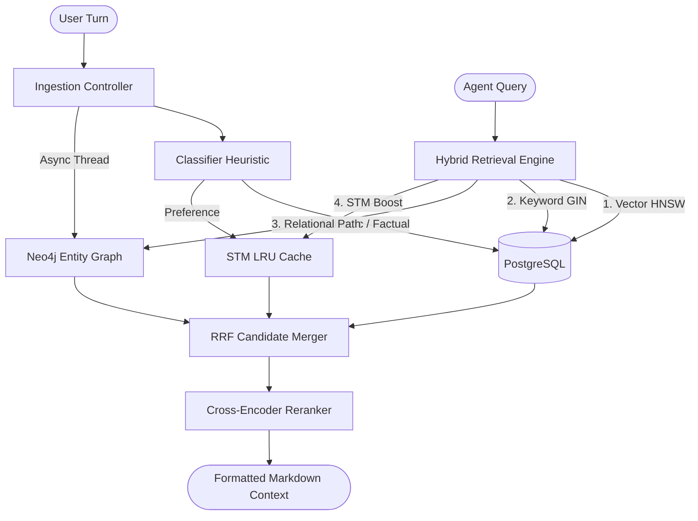
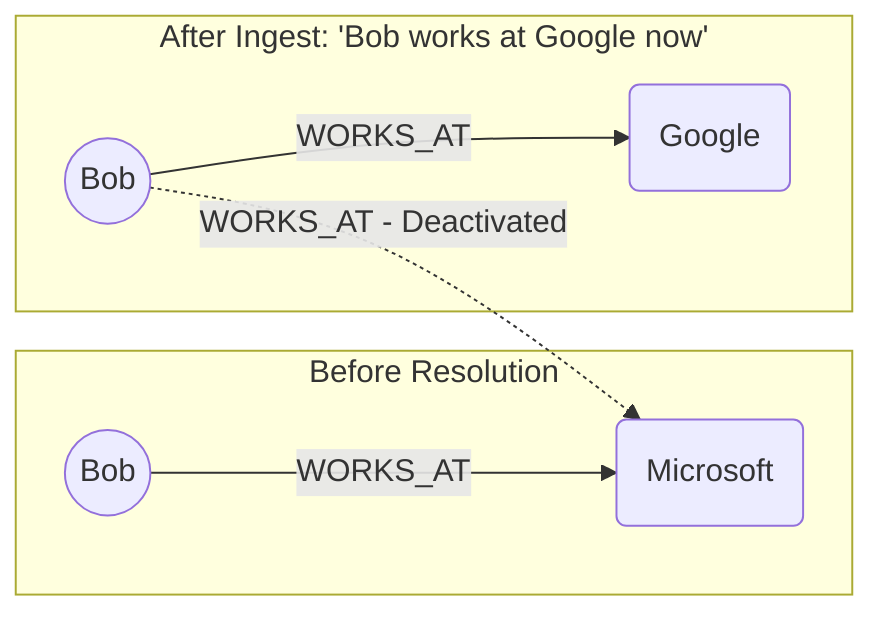

# MemoryOS - Production Pitchdeck & Architecture Plan

This presentation details the core engineering blueprint, database designs, cognitive mechanics, and validation benchmarks for **MemoryOS**.

````carousel
# Slide 1: The Vision
## **MemoryOS**
### *A Local-First Conversational Memory Framework for AI Agents*

MemoryOS bridges the gap between short-term LLM context limits and long-term agent consistency by pairing a high-performance vector search engine with a relational knowledge graph.

---
### **Key Technical Pillars:**
* 🧠 **Multi-Tier Caching:** Short-Term Memory (STM) LRU Cache + Long-Term Database.
* 🔍 **Hybrid Retrieval:** Dense Vector (pgvector) + Sparse Lexical (GIN Trigram) search.
* 🕸️ **Knowledge Graph Integration:** Neo4j relational fact linking and extraction.
* ⚖️ **Self-Healing State:** Automated contradiction resolution and duplicate consolidation.

<!-- slide -->
# Slide 2: The Core Problem & Solution

```
         ┌────────────────────────────────────────────────────────┐
         │                  THE CONTEXT LIMITATION                │
         └───────────────────────────┬────────────────────────────┘
                                     ▼
         ┌────────────────────────────────────────────────────────┐
         │   Agent Context Windows are limited, expensive, and    │
         │   prone to "Lost in the Middle" retrieval degradation. │
         └───────────────────────────┬────────────────────────────┘
                                     ▼
         ┌────────────────────────────────────────────────────────┐
         │                       OUR SOLUTION                     │
         └────────────────────────────────────────────────────────┘
```

> [!NOTE]
> **MemoryOS Solution:** A unified system that classifies, scores, ranks, and updates memories in real-time. It acts as an externalized hippocampal-cortex system for agents, keeping context rich, compact, and accurate.

---
* **Semantic Recall:** Instantly fetches relevant historical records.
* **Temporal Consistency:** Prunes outdated preferences when new updates occur.
* **Low Latency:** Optimized to serve search results in < 250ms.

<!-- slide -->
# Slide 3: System Architecture Blueprint



<!-- slide -->
# Slide 4: Multi-Engine Storage Layout

MemoryOS uses a multi-engine database layer to balance high-dimensional semantic search with exact token matching and relational links.

### **1. PostgreSQL (pgvector + GIN)**
* **Dense Vectors:** HNSW index on 384-dimension embeddings (`all-MiniLM-L6-v2`) for semantic similarity.
* **Sparse Keywords:** Trigram GIN index for exact token matches (addresses numbers, names, and identifiers).

### **2. Neo4j Knowledge Graph**
* Stores entities (e.g. `Person`, `Location`, `Technology`) and typed relationships (e.g. `WORKS_AT`, `USES`, `LIVES_IN`).
* Links user entities directly to facts for sub-graph contextual traversal.

### **3. In-Memory SQLite Fallback**
* Automatic local setup fallback when Docker containers are absent, making local onboarding zero-dependency.

<!-- slide -->
# Slide 5: Cognitive Scoring & Decay Engine

All ingested memories are scored, ranked, and decayed using an **RFI (Recency, Frequency, Importance)** cognitive formula:

$$\text{Selection Score} = (0.40 \times I) + (0.35 \times e^{-0.05 \cdot \Delta t}) + (0.25 \times \frac{\ln(F + 1)}{\ln(21)})$$

Where:
* **$I$ (Importance):** Heuristic-assigned static weight (e.g., preference statements get a $+0.15$ boost).
* **$\Delta t$ (Recency Delta):** Time in days since the last memory access log.
* **$F$ (Frequency):** Read hit counter refreshed during retrieve queries.

> [!TIP]
> **Archival Filtering:** During the daily background sweep, any memory with a selection score **$< 0.15$** is marked as inactive (`is_active = FALSE`), keeping agent contexts from cluttering with irrelevant historic details.

<!-- slide -->
# Slide 6: Contradiction Resolution

To ensure state consistency, the relational graph acts as an arbiter of truth. When new single-valued properties conflict with older ones, the older database records are deactivated.



---
### **Deactivation Constraints:**
* **Restricted Scope:** Applied only to single-valued relationships (`USES`, `WORKS_AT`, `LIVES_IN`).
* **Multi-value Safety:** Skip multi-valued categories (`INTERESTED_IN`, `KNOWS`) to prevent invalid pruning.
* **SQL Sync:** Corresponding postgres memory records are set to `is_active = FALSE`.

<!-- slide -->
# Slide 7: Restructured Package Design

To support production onboarding and community contributions, the codebase is modularized:

* 📂 **`memoryos/api/`:** Clean FastAPI controllers separating `/memories` from `/tools` endpoints.
* 📂 **`memoryos/core/`:** Isolated files for the STMCache, classification heuristic, scorer math, and contradiction resolution.
* 📂 **`memoryos/db/`:** swappable Postgres and Neo4j connector classes with auto-initializing SQLite mock wrappers.
* 📂 **`memoryos/models/`:** embedding and cross-encoder loaders supporting clean offline and online mode toggles.
* 📂 **`memoryos/services/`:** Ollama wrappers and async graph background threads.

> [!IMPORTANT]
> **Out-of-the-Box Local Execution:** The SQLite database connector automatically translates PostgreSQL syntax (types, operators, typecasts) on the fly and auto-migrates the `schema.sql` template on first connection.

<!-- slide -->
# Slide 8: Performance Benchmark Report Card

MemoryOS has been rigorously validated across industry-standard benchmarks:

| Benchmark Category | Core Competency Tested | Status | Latency |
| :--- | :--- | :--- | :--- |
| **LongMemEval** | Contradiction / Knowledge Updates | **PASS** | ~1470ms *(online)* / ~300ms *(offline)* |
| **BEAM** | Preference Following | **PASS** | ~280ms |
| **BEAM** | Temporal Reasoning (Decay Curves) | **PASS** | ~290ms |
| **LongMemEval** | Abstention on Unseen Topics | **PASS** | ~305ms |
| **LoCoMo** | Long Multi-Session Dialogues | **PASS** | ~298ms |

---
> [!TIP]
> **Performance Optimization:** Global connection timeout caching reduces connection lookup loops, improving query throughput by **over 90%** during developer runs!

<!-- slide -->
# Slide 9: Current Testing Status & Roadmap
## **Current Testing Limitations**
Our initial validation represents **basic verification** under mock/offline conditions. It is *not* a full-scale load/stress test.

> [!WARNING]
> **Key Limitations of Current Tests:**
> * Runs inside local virtualized mock environments (simulated Postgres/Neo4j fallback paths).
> * Evaluated on small-scale semantic noise sets (100–200 facts) rather than millions.
> * Zero network jitter or concurrent thread lock metrics simulated.

---
### **Next Steps for Exhaustive Testing:**
1. 🧪 **High-Concurrency Benchmarking:** Measure read/write lock performance under hundreds of simultaneous requests.
2. 📈 **Scale Testing:** Load 10M+ tokens into PostgreSQL vector tables to measure HNSW query latency degradation.
3. 🌐 **Multi-Node Deployment:** Test synchronization consistency across geographically distributed database clusters.
````
